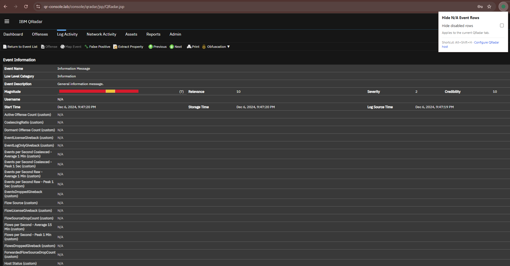
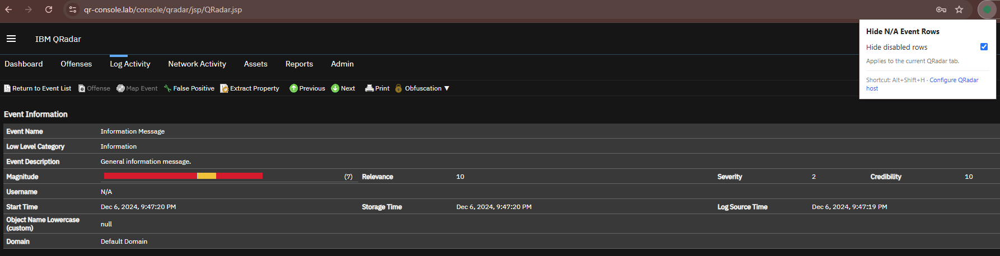
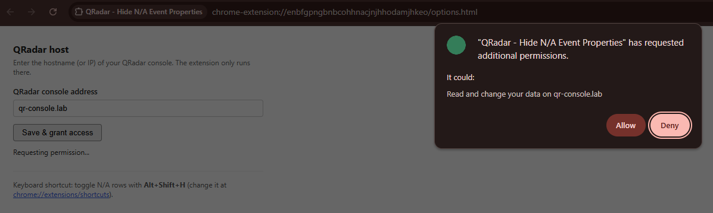

# QRadar - Hide N/A Event Properties


A small Chromium browser extension that hides disabled / N-A rows in the
IBM QRadar event investigation "Event Properties" table, with a one-click
toggle to bring them back.

| Before | After |
|---|---|
|  |  |

## Features

- Hides `tr.disabledRow` rows in the QRadar event details table automatically.
- Popup toggle to show/hide N/A rows on demand.
- Keyboard shortcut (`Alt+Shift+H` by default, remappable at
  `chrome://extensions/shortcuts`) to toggle without opening the popup.
- Works against any QRadar console — you configure your console's
  hostname/IP once in the extension's options page.
- No remote code, no network requests, no data collection. Everything runs
  locally against the DOM of your QRadar tab.

# Installing 

## chrome web store

Straight from the [chrome web store](https://chromewebstore.google.com/detail/qradar-hide-na-event-prop/nmnemlnfcheohfakpckkffgdfeklimpj) (as simple as that!!!).

## unpacked / developer mode

1. Download or clone this repository.
2. Open `chrome://extensions` (or the equivalent in your Chromium browser).
3. Enable **Developer mode** (top right).
4. Click **Load unpacked** and select the `qradar-hide-na` folder.
5. Click the extension icon, then **Configure QRadar host**, and enter your
   QRadar console's hostname or IP (e.g. `qradar.mycompany.com` or
   `172.16.100.2`). Grant the permission prompt.

   

6. Reload your QRadar tab. N/A rows in the event properties table will be
   hidden automatically.

> Not yet on the Chrome Web Store — coming soon. Until then, install unpacked
> as above.

## Usage

- Click the extension icon and use the **Hide disabled rows** toggle.
- Or press **Alt+Shift+H** while on your QRadar tab.
- Your preference is saved and applied automatically as you navigate
  between events.

## How it works

The content script locates the event properties table (the `table.details`
element following `#EventHeader`), and toggles a CSS class on rows with the
`disabledRow` class to hide/show them. A `MutationObserver` re-applies this
whenever QRadar re-renders the panel (it loads event details via AJAX).

The extension only gains access to the host you explicitly configure in
its options page (via the Chrome `optional_host_permissions` /
`chrome.permissions` API) — it does not request broad access to all sites
up front. The service worker in `background.js` registers the content
script dynamically for that one host and handles the keyboard shortcut.

## Project structure

```
qradar-hide-na/
├── manifest.json      # MV3 manifest — permissions, commands, options page
├── background.js      # service worker: dynamic content script registration + shortcut
├── content.js         # hides/shows N/A rows in the event properties table
├── content.css        # the qr-hide-na hidden-row class
├── options.html/.js   # configure your QRadar host, request permission
├── popup.html/.js     # toggle + link to options
└── icons/
```

## Privacy & permissions

This extension collects nothing and phones home to nowhere. It only reads
and modifies the DOM of the single QRadar host you configure. See the
[security notes](#how-it-works) above for how host access is scoped.

## Contributing

Issues and pull requests are welcome. Please keep changes scoped and avoid
adding new permissions or network calls without discussion.

## License

MIT — see [LICENSE](LICENSE).
